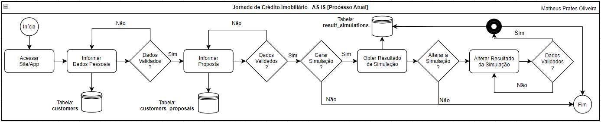
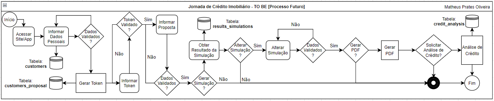
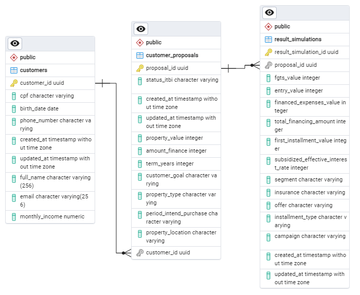
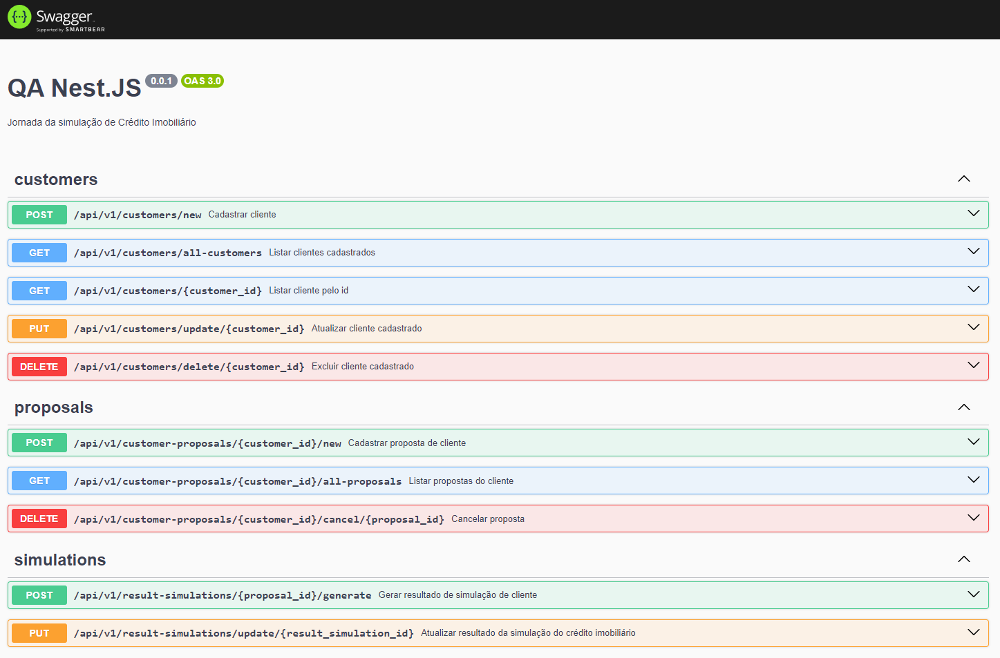

<h1 align="center">QA NestJS</h1>

<h2>Etapa 1</h2>

- Escrever um caso de teste para efetuar um teste na jornada de simulação de crédito imobiliário ou de automóveis do seu banco de preferência. Importante Relatar se encontrou algum problema na jornada e evidenciar.
- **Obs**: Mesmo que não tenha problema é importante evidenciar todo o teste

<h2>Etapa 2</h2>

- Desenhar o processo **As Is** (estado atual do processo), desenhar o **To be** (processo futuro do que poderia ser melhorado na jornada de crédito).
- **Obs**: pode usar qualquer ferramenta de desenho de processo baseada em BPM - BPMN
- exemplo: bizagi
  .
- **Obs**: Mesmo que não tenha problema é importante evidenciar todo o teste

<div align="center">
  
  <p><i>Processo AS-IS</i></p>
</div>

<div align="center">
  
  <p><i>Processo TO-BE</i></p>
</div>

**NOTA**: Ambas as imagens podem ser encontradas na pasta `GitHub/images` deste repositório.

<h2>Algoritmo de teste para crédito imobiliário</h2>

Criei uma API para escrever os casos de teste na jornada de simulação de **crédito imobiliário**, tendo como base, o modelo adotado pelo **Banco Santander**. O único problema que encontrei durante o desenvolvimento do projeto e implementação dos testes (unitários) foi a falta de informação disponibilizada sobre os cálculos aplicados taxas (o que me levou a desenvolver um método próprio para seguir com a criação).

<h3>Stack</h3>

- **Node.JS** - como runtime JS e core da API desenvolvida;
- **Nest.JS** - como framework ágil e escalável para soluções robustas e seguras;
- **TypeORM** - como ORM robusto, destaque de mercado, além possuir integração nativa com o Nest.JS, assim como o Prisma ORM;
- **PostgreSQL** - escolhido como banco de dados por ser Open Source e muito flexível;
- **Docker** - para criar imagens do banco de dados citado e garantir que a aplicação execute em todas as máquinas;
- **Class Validator** - para validação dos dados (usado na camada DTO);
- **Swagger** - para documentação de todos os endpoints da API desenvolvida, além de facilitar o entendimento da aplicação e seus módulos, e sem esquecer, é claro, que é uma ótima ferramenta visual;

```sh
# Gerando módulo de cliente
nest g module app/customers
nest g controller app/customers
nest g service app/customers

# Gerando módulo de proposta do cliente
nest g module app/customer_proposals
nest g controller app/customer_proposals
nest g service app/customer_proposals

# Gerando módulo de resultado da simulação
nest g module app/result_simulation
nest g controller app/result_simulation
nest g service app/result_simulation
```

<h3>Padrão utilizado nos testes</h3>

- **AAA**: Arrange, Act e Assert;

<h3>Regras (criadas) para simulação</h3>

- O "valor a financiar" da proposta não pode ser superior a 70% do "valor do imóvel";
- A soma do prazo do financiamento com a idade do proponente mais velho não poderá ser superior a 80 anos e 6 meses.

<h3>Modelo Relacional (PostgreSQL)</h3>

<div align="center">
  
  <p><i>O cliente tem relação 1:N com a proposta do cliente, e este tem relação 1:1 com resultado da simulação</i></p>
</div>

<h3>Documentação com Swagger</h3>

<div align="center">
  
  <p><i>Acesse: <code>http://localhost:4090/swagger#/</code>!</i></p>
</div>

<br>
<div align="center">
  <h2>Thanks 4 everyone!</h2>
  <p>Made w/ 💙 by <a href="https://github.com/pratesMath">pratesMath</a>.</p>
</div>
